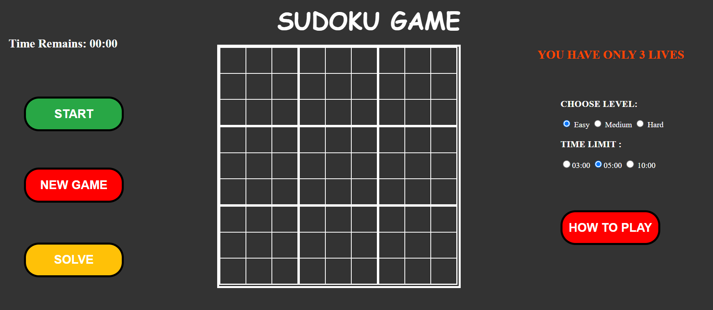

# Sudoku Game

Sudoku is a logic-based number-placement puzzle.

## Description

This Sudoku game allows users to choose from different difficulty levels (easy, medium, hard) and provides a timer to make the game more challenging. It features a user-friendly interface and interactive gameplay.

## Files in the Directory

- `index.html`: The main HTML file that contains the structure of the Sudoku game.
- `styles/`
  - `style.css`: The CSS file that styles the Sudoku game.
  - `bootstrap.min.css`: The minified Bootstrap CSS file.
  - `bootstrap.css`: The Bootstrap CSS file.
- `js/`
  - `Game.js`: Contains the main game logic and functions.
  - `board.js`: Dynamically creates the Sudoku board and user interface elements.

## Functions in `Game.js`

### `help()`

This function opens a new tab or window with a URL containing instructions on how to play Sudoku.

### `Start()`

This function starts the game by disabling clicking on difficulty labels, starting the timer, and selecting a random board based on the chosen difficulty level. It also removes the `onclick` attribute from the start button to prevent multiple starts.

### `random(levels, board)`

This function selects a random board from the provided array based on the difficulty level and populates the Sudoku grid with pre-defined values, making those cells read-only.

### `winORLose(levels)`

This function checks periodically if the game is won or lost. It compares the user's inputs with the solved board data and handles win/lose conditions, including updating the remaining lives and providing feedback to the user.

### `Solve()`

This function fills the Sudoku grid with the solved board data, effectively providing the solution to the current game.

### `Restart()`

This function clears the Sudoku grid and restarts the game by calling the `Start()` function.

### `timer()`

This function manages the game timer, decrementing the seconds and minutes, and handles the game-over condition when the time runs out.

## Functions in `board.js`

### Board Creation

This script dynamically creates the Sudoku game board, including rows, squares, and cells with input elements. It also creates and configures the game control buttons (Start, Restart, Solve) and the difficulty level and timer selection elements.

### `createButton(id, text, clickHandler)`

This function creates a button with the specified ID, text, and click event handler.

## Screenshot

## Live Demo

Check out the live demo of the Sudoku Game [here](https://yassenali.github.io/Sudoku-Game/).

---

Feel free to explore the files and see how everything is implemented. Enjoy solving Sudoku puzzles!
